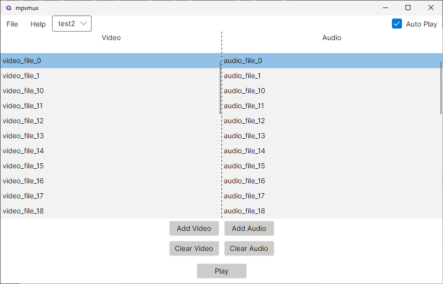

## MPV External Audio Manager

A lightweight desktop application for managing external audio tracks with MPV media player.



## Why does this exist?
MPV supports drag-and-drop for subtitles but requires command-line flags like ```--audio-file=track.mp3``` for external audio tracks.
This is fine for a single file, but when you have multiple videos each with their own audio tracks, it becomes tedious. And if you want to play it in sequence - it becomes a nightmare.

This tool automates the process - you select your video files, audio files, hit play, and it handles the integration automatically.

## Features
- 🎵 **Easy Audio Management**: Quickly attach external audio tracks to your video playback
- ⚡ **MPV Integration**: Seamlessly works with your existing MPV installation
- 📁 **File Organization**: Save and load audio track configurations for repeated use

## Usage
1. Launch the application
2. Add video files & audio buttons
3. Add corresponding audio files in the same order
4. Hit Play - MPV will launch with audio tracks attached

## Installation
### Windows
1. Download the latest release from [Releases Page](https://github.com/regularentropy/mpvmux/releases/latest)
2. Ensure MPV is installed and is in your system PATH
3. Unzip & run the executable.

## License
[GPLv3](LICENSE) © [2025] regularentropy